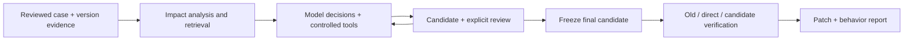

# Upgrade Workbench

面向 Python 依赖迁移的可验证 Agent 工作台。模型调查受影响代码、查询版本依据并生成补丁，
程序管理候选身份、工具隔离、费用与恢复状态；最终用旧版、直接升级和修复候选执行同一合同。
主要验证范围是 Pydantic v1→v2 与 SQLAlchemy 1.4→2.0 的已登记 Python 案例。

## 第一次运行

需要 Python 3.12 和 uv。行为验证另需已运行的 Docker；服务模式另需自己管理的 PostgreSQL。

```powershell
uv sync --locked --extra service
uv run --no-sync upgrade-workbench --help
uv run --no-sync pytest tests/unit
```

先尝试 [csvsql 固定补丁复验](docs/examples/csvsql/README.md)：无需模型密钥，
能查看 SQL 字面量遗漏、修复及旧 6/6、直接升级 0/6、候选 6/6 的独立检查。
配置模型、账本和新服务的步骤见 [安装与首次使用](docs/public-install.md)。
完整测试需要 service extra，基础 CLI 可只装 core；BGE 混合检索的 Torch extra 按需安装。

## 一次任务得到什么

用户提供经过审查的源码快照、旧/新依赖锁、可修改范围、版本文档和行为合同；
这不是输入任意仓库即保证完成升级的工具。现有业务测试、旧环境行为与官方迁移说明用于
确定检查要求，有冲突时需要明确取舍，不能让补丁同时改自己的验收标准。

模型选择读取代码、查询依赖、运行受控诊断、修改候选或结束任务。
程序校验修改范围与候选修订，第三方代码仅在 Docker 中运行；候选需要明确审阅，
最终验收在冻结后独立执行。输出包括补丁、验证配置、结构化行为差异报告和任务状态。
失败、预算耗尽、未知远端结果和验收不通过分别保留。



## 模块与可靠性

| 模块 | 主要职责 |
| --- | --- |
| `analysis` / `evidence` / `semantic` | AST 影响点、别名与未知边界；固定版本原文；BM25 / 可选 BGE-M3、RRF 与 reranker |
| `generation` | 请求准备、源码导航、工具动作；可选调查/知识复核角色、跨修订原文重读与知识修订 |
| `tasks` / `candidates` / `diagnostics` | 多轮状态、候选身份、审阅、诊断与停止规则 |
| `execution` / `workflow` | Docker 隔离、三环境比较、通过/失败/无效测量分类 |
| `budget` / `reporting` | SQLite 事务费用预留、请求收据和精选报告导出 |
| `service` | FastAPI 接口、PostgreSQL 作业与互斥、LangGraph 检查点、恢复协调 |

请求发送前先持久化身份。远端可能已执行而本地没有完整回执时，状态进入
`outcome_unknown`，恢复不盲目重发。任务文件、账本、PG 作业与检查点分别保存不同对象，
不存在靠一张表推断所有外部副作用都“恰好一次”的保证。

## 现有结果与限制

[精选正反比较](docs/examples/comparison/README.md)同时保留两轮历史结果：
A2 三任务比较中 W 估算费用高 46.7%；A5 Continuum 单案例中，相同验收下 W
请求少 72.4%、估算费用低 45.4%。简单工具 Agent 基线可以补读源码与调用工具。
这是已见/准入开发案例、每臂两次的整套配置比较，不能推出通用优势或组件因果。

[版本语义自查比较](docs/joint-r2-agent.md)单列一个可选Solver机制的首次结果与限制，
不与历史整套工作台的费用结论合并；具体难点仍可沿csvsql案例、补丁和独立检查复核。

维护增量提供[可选语义差分诊断](docs/probe-comparisons.md)及
[有界输入生成组件](docs/probe-input-generation.md)，旧版、候选的具体观察严格区分
`same/different/incomplete`；默认策略与独立验收不变。
[可选值案例](docs/results/semantic-boundaries-a1/README.md)已有有效读数进入真实模型后继动作，
但候选在此前已经生成，两臂验收相同；定向输入与穷举也没有检出差异。
因此不宣称新接口提高修复质量或稳定降本，自动生成仍未接入普通Agent。

源码分析不是完整调用图，动态导入、包装与复杂绑定存在未知边界。
合同并不穷尽全部业务行为：csvsql 的原四项检查曾漏掉冒号字面量。
当前没有生产用户、人工节省工时、广泛未见迁移成功率或生产 SLA 的主张。

## 开发与发布状态

[开发指南](CONTRIBUTING.md)说明验证与代码约定；[公开测试](docs/public-tests.md)区分
产品测试和私有历史现场。[第三方归因](THIRD_PARTY_NOTICES.md)列出实际分发材料。
自有代码采用 [MIT](LICENSE)，第三方材料保持各自许可。仓库为
[PlainSightX/upgrade-workbench](https://github.com/PlainSightX/upgrade-workbench)，
首发版本为 `v0.0.1`；各提交的远端检查结果以对应 Actions 运行记录为准。
历史评估的实现身份与本次发行分开。公开源码采用精选初始历史，不包含私人旧 Git 历史、
原模型请求、账本或大量日志；[文件与来源清单](PUBLICATION.json)可核对发行内容。
